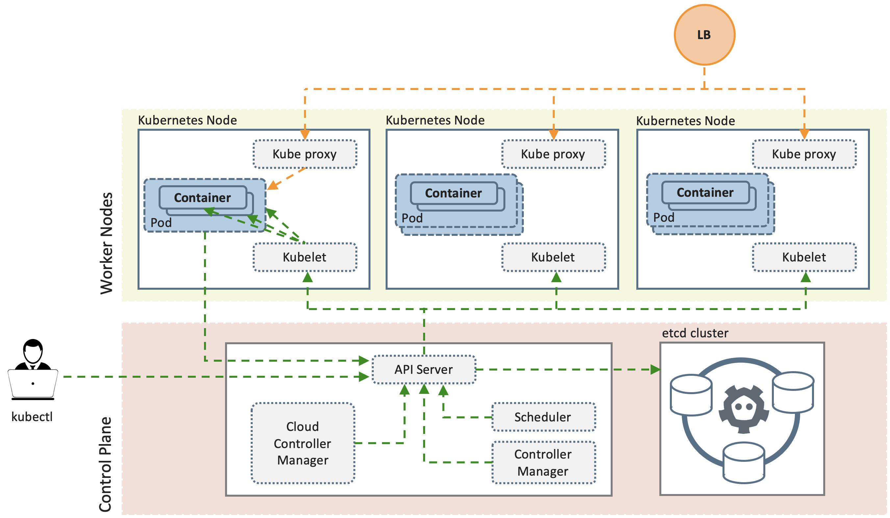
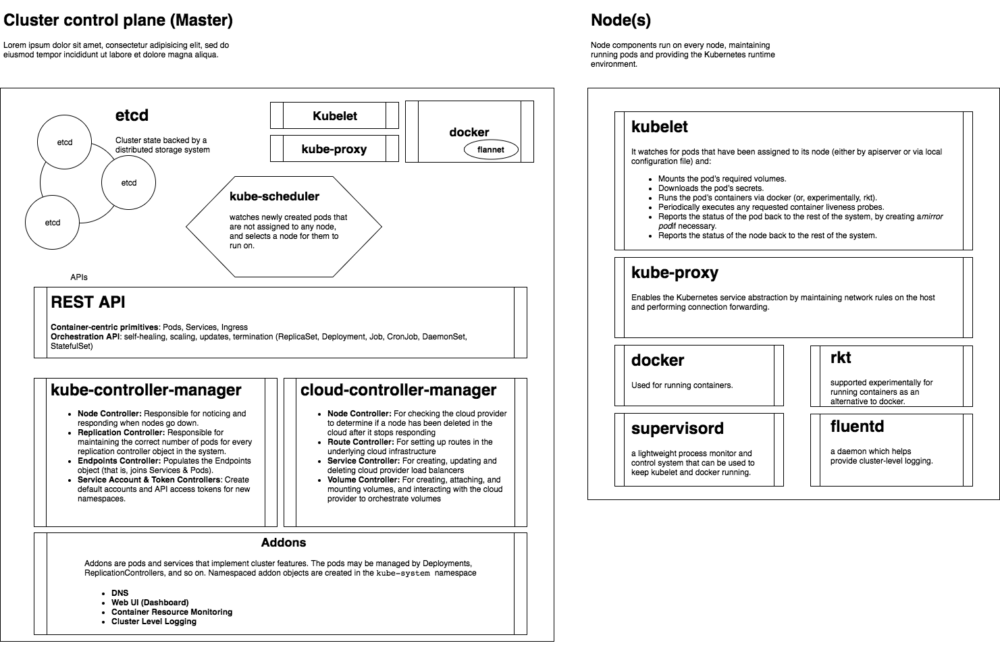

# Local Kubernetes Environment on Vagrant/Virtualbox and CentOS 7

## Kubernetes Architecture



## HOW TO
- [Config File](config.rb)
- [Vagrantfile](vagrant/)

```
$ make up
$ make load
$ make whoup
$ make ssh
$ make down
$ make destroy

# K8s Dashboard
$ kubectl proxy

# K8s bash completion
$ source <(kubectl completion bash)
 
$ kubectl get nodes
...
```

## Cluster Configuration
- [X] Docker 18.09
- [X] Kubernetes (multiple versions: [configuration](config.rb#L14))
- [X] Master + Workers (worker_count > 0) / Master Isolation (worker_count = 0), [configuration](config.rb#L8)
- [X] MetalLB (Pluggable)
- [X] Metrics-Server
- [X] Kuebernetes Dashboard
- [X] Flannel
- [X] Nginx Ingress-Controller

### Configuration Samples and Keynotes
- [x] Application (Deployment, Service, Ingress Rules)
- [x] Networking (ClusterIP, ExternalIP, NodePort)
- [x] Users
- [ ] Secrets
- [ ] ConfigMap
- [ ] Storages / GlusterFS
- [ ] RBAC
- [ ] Helm Tiller
- [x] Prometheus

## Kubectl Cheatsheet
```
$ kubectl cluster-info
$ kubectl cluster-info dump

$ kubectl get nodes
$ kubectl get pods
$ kubectl get rc
$ kubectl get deploy
$ kubectl get rs
$ kubectl rollout status deploy DEPLOY_NAME

$ kubectl run nginx-deployment --image=nginx --port=80
$ kubectl expose deployment nginx-deployment --port=80 --type=NodePort 

$ kubectl expose deployment nginx-deployment --external-ip="192.168.56.150" --port=8000 --target-port=80
$ kubectl get svc nginx-deployment 
$ kubectl get svc nginx-deployment -o go-template='{{range.spec.ports}}{{if .nodePort}}{{.nodePort}}{{"\n"}}{{end}}{{end}}'
$ kubectl get deployment nginx
$ kubectl describe deployment nginx-deployment

$ kubectl run nginx-deployment --image=nginx --port=80 --replicas=1
$ kubectl run nginx-deployment --image=nginx --port=80 --replicas=1 --hostport=8001
$ kubectl scale --replicas=10 deployment nginx-deployment

$ kubeadm init --token=102952.1a7dd4cc8d1f4cc5 --kubernetes-version v1.8.0
$ kubeadm token list
$ kubeadm join --token 102952.1a7dd4cc8d1f4cc5 172.17.0.43:6443

$ kubectl apply -f https://git.io/weave-kube
$ kubectl apply -f "https://cloud.weave.works/k8s/net?k8s-version=$(kubectl version | base64 | tr -d '\n')"
$ kubectl get pod -n kube-system

$ kubectl exec -n ingress-nginx $(kubectl get pods -n ingress-nginx | grep controller | awk '{print $1}') cat /etc/nginx/nginx.conf
$ kubectl logs -n ingress-nginx $(kubectl get pods -n ingress-nginx | grep controller | awk '{print $1}')


$ kubectl run cent --image=sbeliakou/centos --command sleep 3600
$ dig @10.96.0.10 grafana.monitoring.svc.cluster.local

```